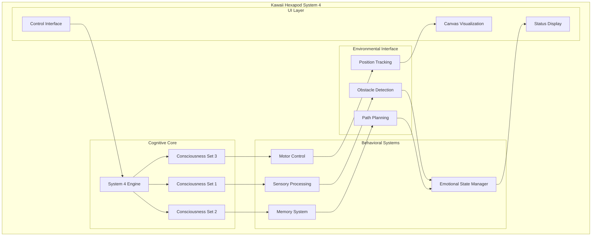
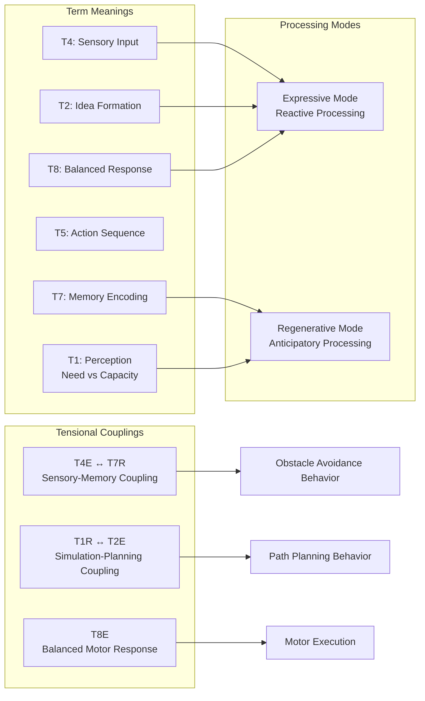
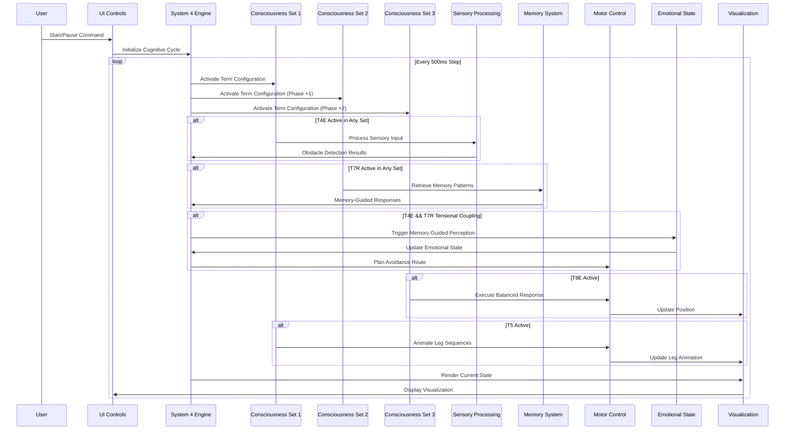
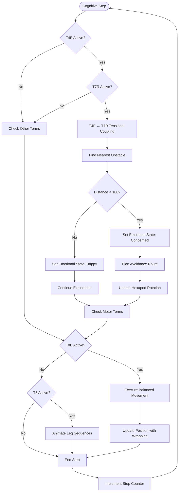
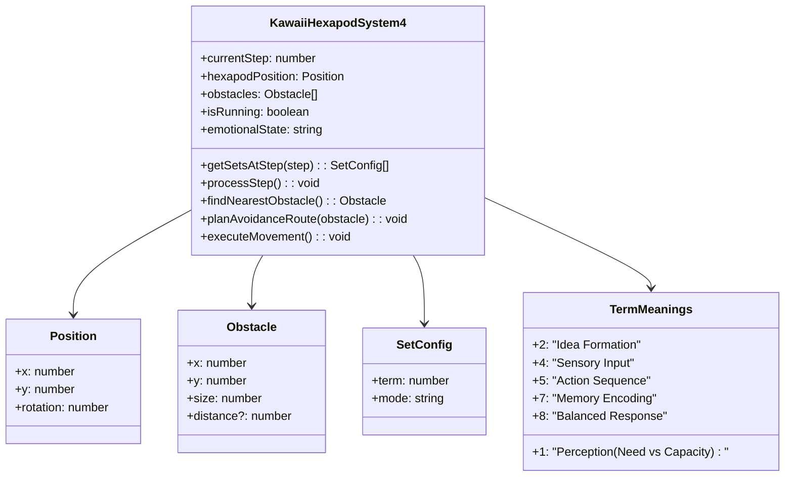
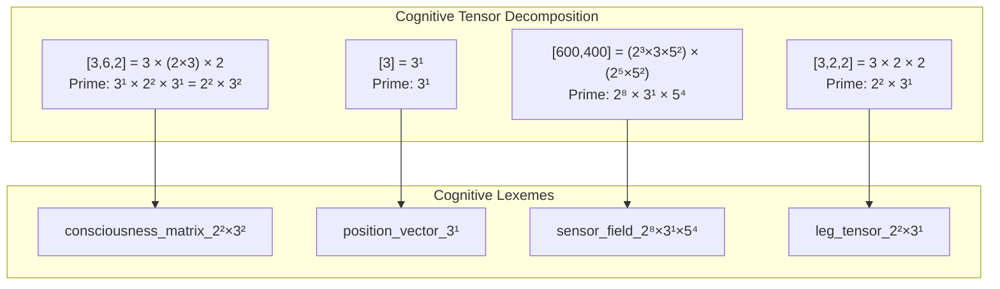
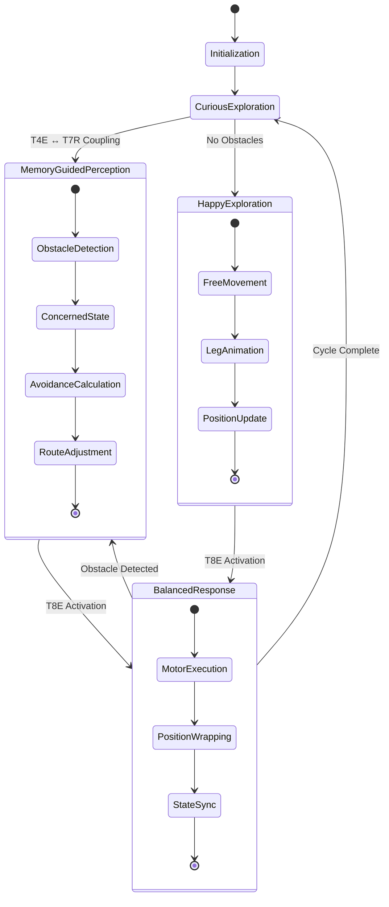

# kawaii-hexapod-system4.tsx: Technical Architecture & Process Flow

## Overview

The kawaii-hexapod-system4.tsx component implements a distributed cognitive control system for a hexapod robotic system using Campbell's System 4 architecture. It demonstrates emergent intelligent behavior through the dynamic interplay of three parallel consciousness streams, each operating in either Expressive (reactive) or Regenerative (anticipatory) modes.

## Core Features

- **Distributed Cognitive Control**: Three parallel consciousness sets running one step out of phase
- **Neural-Symbolic Integration**: Tensional coupling between sensory input (T4E) and memory recall (T7R)
- **Adaptive Attention Allocation**: Dynamic emotional state management based on environmental feedback
- **Real-time Visualization**: Canvas-based hexapod simulation with obstacle avoidance
- **Emergent Behavior**: Intelligent navigation emerging from cognitive set interactions

## Technical Architecture

### High-Level Component Map



### System 4 Cognitive Architecture



## Process Flow Dynamics

### Primary Cognitive Cycle



### Tensional Coupling Dynamics



## Component Interaction Topology

### State Management Architecture



### Canvas Rendering Pipeline

```mermaid
flowchart LR
    subgraph "Rendering Pipeline"
        ClearCanvas[Clear Canvas] --> DrawObstacles[Draw Pink Obstacles]
        DrawObstacles --> SaveContext[Save Canvas Context]
        SaveContext --> TransformCoords[Transform to Hexapod Coords]
        TransformCoords --> DrawBody[Draw Hexapod Body]
        DrawBody --> DrawLegs[Draw 6 Animated Legs]
        DrawLegs --> DrawFace[Draw Emotional Face]
        DrawFace --> DrawAntennae[Draw Term-Indicating Antennae]
        DrawAntennae --> RestoreContext[Restore Canvas Context]
    end
    
    subgraph "State Dependencies"
        CurrentStep[currentStep] --> LegAnimation[Leg Phase Calculation]
        HexapodPos[hexapodPosition] --> TransformCoords
        ObstacleArray[obstacles[]] --> DrawObstacles
        EmotionalState[emotionalState] --> DrawFace
        ActiveSets[getSetsAtStep()] --> DrawAntennae
    end
    
    LegAnimation --> DrawLegs
```

## Neural-Symbolic Bridges

### Tensor Shape Implications

The System 4 architecture operates with implicit tensor dimensions that correspond to cognitive processes:

```typescript
// Implicit Tensor Shapes in Cognitive Processing
interface CognitiveTensorShapes {
  // Consciousness Set States: [3 sets] × [6 terms] × [2 modes]
  consciousnessState: [3, 6, 2],  // Prime factors: [3, 2×3, 2]
  
  // Hexapod Position State: [x, y, rotation]
  positionVector: [3],             // Prime factors: [3]
  
  // Obstacle Detection Field: [width, height] 
  sensorField: [600, 400],         // Prime factors: [2³×3×5², 2⁵×5²]
  
  // Leg Configuration: [3 pairs] × [2 legs] × [2D coordinates]
  legTensorField: [3, 2, 2],       // Prime factors: [3, 2, 2]
  
  // Emotional State Vector: [happy, concerned, curious]
  emotionalVector: [3],            // Prime factors: [3]
  
  // Term Activation Matrix: [6 terms] × [step_cycle]
  termActivation: [6, 12]          // Prime factors: [2×3, 2²×3]
}
```

### Prime Factorization Pathways



## Emergent Process Flows

### Cognitive Emergence Patterns



### Adaptive Attention Allocation

The system demonstrates adaptive attention through:

1. **T4E (Sensory) + T7R (Memory) Coupling**: Creates memory-guided perception for obstacle avoidance
2. **T1R (Perception) + T2E (Idea Formation) Coupling**: Enables simulation-based planning
3. **T8E (Balanced Response)**: Coordinates motor execution with environmental feedback
4. **T5 (Action Sequence)**: Manages rhythmic leg animation patterns

## Implementation Pathways

### React Component Architecture

```typescript
// Core State Management
const [currentStep, setCurrentStep] = useState<number>(0);
const [hexapodPosition, setHexapodPosition] = useState<Position>({x: 250, y: 300, rotation: 0});
const [obstacles, setObstacles] = useState<Obstacle[]>([...]);
const [emotionalState, setEmotionalState] = useState<EmotionalState>('curious');

// System 4 Configuration Matrix
const getSetsAtStep = (step: number): SetConfig[] => {
  const cycle = step % 12;
  return setConfigs[cycle]; // 12-step phase-shifted configuration
};

// Cognitive Processing Pipeline
const processStep = (): void => {
  const sets = getSetsAtStep(currentStep);
  
  // Tensional coupling detection
  const hasT4E = sets.some(s => s.term === 4 && s.mode === 'E');
  const hasT7R = sets.some(s => s.term === 7 && s.mode === 'R');
  
  if (hasT4E && hasT7R) {
    // Memory-guided perception pathway
    handleMemoryGuidedPerception();
  }
  
  // Motor execution pathways
  if (sets.some(s => s.term === 8 && s.mode === 'E')) {
    executeMovement();
  }
  
  if (sets.some(s => s.term === 5)) {
    animateLegs();
  }
};
```

### Canvas Rendering Engine

```typescript
// Hexapod Visualization with Cognitive State Mapping
useEffect(() => {
  const canvas = canvasRef.current;
  const ctx = canvas.getContext('2d');
  
  // Environmental rendering
  renderObstacles(ctx, obstacles);
  
  // Hexapod embodiment with cognitive indicators
  ctx.save();
  ctx.translate(hexapodPosition.x, hexapodPosition.y);
  ctx.rotate(hexapodPosition.rotation * Math.PI / 180);
  
  // Render body with emotional state coloring
  renderHexapodBody(ctx, emotionalState);
  
  // Render legs with System 4 activation patterns
  renderLegsWithCognitiveState(ctx, getSetsAtStep(currentStep));
  
  // Render antennae indicating dominant cognitive terms
  renderCognitiveAntennae(ctx, getDominantTerm(getSetsAtStep(currentStep)));
  
  ctx.restore();
}, [currentStep, hexapodPosition, obstacles, emotionalState]);
```

## Actionable Steps / Issues

### High Priority Documentation Tasks

- [ ] **Tensor Shape Annotation**: Annotate all exported functions with precise tensor dimensions and cognitive roles
- [ ] **Emergent Flow Documentation**: Document complete emergent behavior patterns between UI, Control, and Cognitive modules
- [ ] **GGML Integration Specification**: Define integration pathways with GGML kernel for tensor-based cognition
- [ ] **Test Coverage Implementation**: Implement comprehensive test suite for distributed cognition pathways
- [ ] **Performance Optimization**: Profile and optimize cognitive cycle performance for real-time operation

### Medium Priority Enhancement Tasks

- [ ] **Multi-Hexapod Coordination**: Extend architecture to support multiple coordinated hexapod agents
- [ ] **Enhanced Memory System**: Implement persistent memory storage and retrieval mechanisms
- [ ] **Advanced Obstacle Types**: Support dynamic and intelligent obstacle behaviors
- [ ] **Sensory Modality Expansion**: Add additional sensory channels (audio, chemical, etc.)
- [ ] **Meta-Cognitive Monitoring**: Implement self-reflection and meta-learning capabilities

### Low Priority Research Tasks

- [ ] **Consciousness Quantification**: Develop metrics for measuring consciousness emergence
- [ ] **Cross-Modal Integration**: Explore integration with other sensory modalities
- [ ] **Scalability Analysis**: Analyze computational complexity for larger hexapod swarms
- [ ] **Biological Validation**: Compare behavior patterns with biological hexapod systems
- [ ] **Educational Visualization**: Create interactive tutorials for System 4 concepts

## Knowledge Gaps Requiring Investigation

1. **GGML Tensor Integration**: How to map System 4 cognitive states to GGML tensor operations
2. **Prime Factorization Semantics**: Establishing clear semantic meaning for prime factor decompositions
3. **Consciousness Measurement**: Quantitative metrics for consciousness emergence in the system
4. **Scalability Boundaries**: Performance limits for multiple concurrent hexapod agents
5. **Memory Persistence**: Optimal strategies for long-term memory storage and retrieval

## References

- Campbell, Jeremy. "System 4: The Three-Set Architecture of Consciousness"
- OpenCog Hyperon Framework Documentation
- P9ML Membrane Computing Integration Patterns
- Vervaeke Framework for 4E Cognition
- SiliconSage Cognitive Synergy Patterns